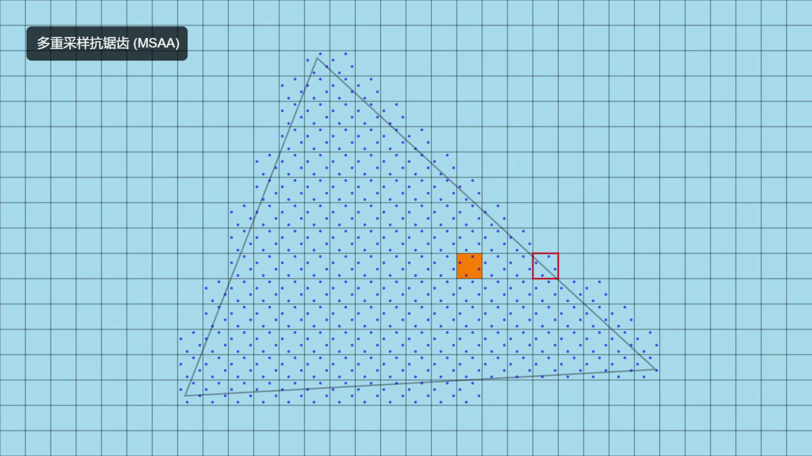
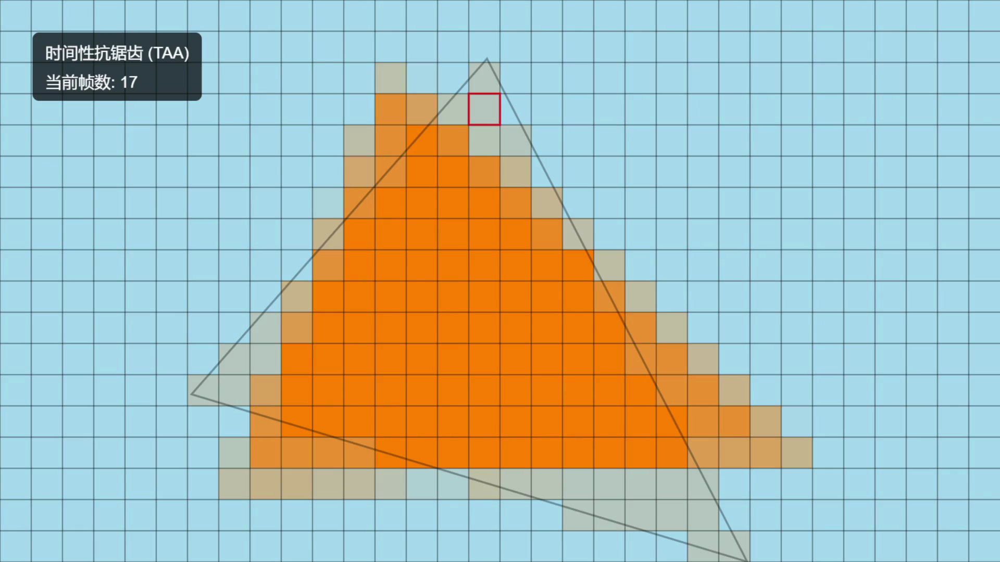

抗锯齿（Anti-Aliasing, AA）是实时渲染中最重要的画质技术之一。本文系统整理当前主流的抗锯齿算法，包括全称、中文名、性能开销、效果、伪像。

<canvas id="myCanvas" style="width: 100%;"></canvas>

> Canvas 若无法显示请刷新页面  
> 修改自 [phu004/aa_tutorial](https://github.com/phu004/aa_tutorial)  
> 视频资源 [BV13z4y1K7CC](https://www.bilibili.com/video/BV13z4y1K7CC/)

# 1. 基于超采样

## 超级采样抗锯齿（Super-Sampling Anti-aliasing，SSAA）

超级采样抗锯齿是早期抗锯齿方法，比较消耗资源，但简单直接，先把图像映射到缓存并把它放大，再用超级采样把放大后的图像像素进行采样，一般选取 2 个或 4 个邻近像素，把这些采样混合起来后，生成的最终像素，令每个像素拥有邻近像素的特征，像素与像素之间的过渡色彩，就变得近似，令图形的边缘色彩过渡趋于平滑。再把最终像素还原回原来大小的图像，并保存到帧缓存也就是显存中，替代原图像存储起来，最后输出到显示器，显示出一帧画面。这样就等于把一幅模糊的大图，通过细腻化后再缩小成清晰的小图。如果每帧都进行抗锯齿处理，游戏或视频中的所有画面都带有抗锯齿效果。

- 性能消耗：非常高（按分辨率的平方增长，例如 2×SSAA 代价 ≈ 渲染 4 倍像素）

- 效果：最佳的锯齿去除，保留高频细节，消除几乎所有几何锯齿与纹理采样别名

- 常见伪像：对运动时模糊明显（因为是高分辨率直接缩放），需要更多内存/带宽

## 多重采样抗锯齿（Multisampling Anti-Aliasing，MSAA）

MSAA 不再仅仅针对像素的中心进行采样，而是在像素的多个不同的位置进行采样。在渲染某个像素时，我们先计算出像素中有多少个采样点被当前正在渲染的图形所覆盖，如果所有的采样点都被覆盖，我们直接将图形的颜色用到该像素上。如果只有部分采样点被覆盖，那么像素将用上图形颜色与背景颜色的混合色，混合比例则取决于被覆盖和没有被覆盖采样点的个数比例。MSAA 在图形边缘处的抗锯齿效果可以达到类似 SSAA 的水平，它和 SSAA 的主要区别在于 MSAA 每一个像素只进行一次渲染，只对像素的 coverage（几何覆盖情况）多采样，而不是对整个像素做多次 shading，从而大大减少了计算量。可以简单理解为只对多边形的边缘进行抗锯齿处理。这样的话，相比 SSAA 对画面中所有数据进行处理，MSAA 对资源的消耗需求大幅减少，不过在画质上可能稍有不如 SSAA。

- 性能消耗：中等到高（常见 2×/4×/8×）；受几何复杂度影响

- 效果：对几何轮廓（边缘）抗锯齿效果好，但它无法解决图形内部的锯齿，也无法解决因为物体移动而出现的闪烁，也对像素着色器中的细节、透明/alpha 测试纹理（草、栅栏）效果差

- 伪像：对 shader aliasing、纹理边缘/alpha 片段无效；在高频纹理或细线条处仍有残留

# 2. 时序抗锯齿

## 时间性抗锯齿（Temporal Anti-Aliasing，TAA）

它通过混合前一帧和当前帧的信息来对全屏进行抗锯齿处理。它和 MSAA 一样，对像素内部不同的位置进行采样，不同的是，它每一帧只采样一个位置，在第一帧中，由于缺少上一帧的信息，所以不做任何处理，从第二帧开始，当渲染完成后，我们把当前画面和上一帧的画面进行混合，作为这一帧的最终画面。随着时间的推移，连续帧之间的采样和混合累积起来就慢慢形成了抗锯齿的效果。

- 性能消耗：高（每帧需要历史缓冲、重投影、融合计算，内存带宽与带来额外延迟）

- 效果：在处理静态图像的效果与 MSAA 不相上下，在动态图像的处理方面它能够分析前一帧和当前帧之间的差异以产生更平滑的边缘和颜色过渡

- 伪像：运动模糊/重影（ghosting）、拖影、对高速移动或快速改变的几何/材质会产生残影；细节可能被“抹平”需锐化或反走样改善

# 3. 基于图像的后处理抗锯齿

## 快速近似抗锯齿（Fast Approximate Anti-Aliasing，FXAA）

FXAA 占用很少的资源，便可得到良好的反锯齿效果，因为它不是分析 3D 模型本身，而是分析像素。具体而言，FXAA 通过在已经渲染完成的图像中寻找图形的边缘来实现抗锯齿效果，这些边缘通常出现在相邻像素颜色发生剧烈变化的地方。一旦找到这些边缘，我们会对边缘的上的像素进行模糊处理，从而达到软化的效果。

- 性能消耗：非常低（几乎是常数开销的像素着色器通道）

- 效果：快速且易于实现的抗锯齿方法，通过检测高对比边缘并模糊它们来消除锯齿，速度快

- 伪像：引入整体模糊、细节损失（尤其是纹理细节和文字），在低对比分明处过度平滑

## 次像素形态学抗锯齿（Subpixel Morphological Anti-Aliasing，SMAA）

SMAA 的基本处理流程建立在 MLAA（形态学抗锯齿）算法之上，是形态学（Morphology）+ 次像素模式匹配的组合。分三步：扫描边缘，判断是‘L 型边缘’、‘Z 型边缘’、‘直线’、‘T 接合点’等不同形状，然后次像素 blend（subpixel blend），根据模式类型，沿准确的边缘方向重构真实的平滑轮廓并混合颜色。这是 SMAA 更干净的原因，因为它对边缘类型的识别更“逻辑化”，比 FXAA 的“盲目模糊”精确得多，因此画面更清晰。

- 性能消耗：中

- 效果：在质量和性能间取得较好平衡；SMAA 能较好保留小细节，抗锯齿边缘精度优于 FXAA

- 伪像：少量轮廓残留/纹理细节模糊；透明处理需要扩展（SMAA 具有对透明的改进版本）

# 4. 深度学习

## 深度学习抗锯齿（Deep Learning Anti-Aliasing，DLAA）

借助基于 AI 的抗锯齿技术，提供更高的图像质量。DLAA 与 DLSS 使用同样的超分辨率技术，在原生分辨率图像的基础上，更大限度地提升图像质量。DLAA 是利用位于远程的深度学习专用 TPU 的深度计算性能，预先运算大量的超级取样样本影像，再将样本影像与在本机端即时运算生成的影像进行差异比较，然后通过学习、观察其中的差距，来重新实现完成前者的影像质量，以达到抗锯齿成果，DLAA 是一个需要远程资源与本地资源互相配合，协同工作产生抗锯齿效果的抗锯齿技术。

- 性能消耗：中等偏高（需 Tensor Core / AI 运算）

- 效果：现代最高质量的单独抗锯齿技术，以“画质为优先”

## 深度学习上采样（Upsampling）

虽然不是纯 AA 技术，但因为几乎所有现代游戏将它们当作“抗锯齿 + 上采样”一体使用，因此列入。

### 深度学习超级采样（Deep Learning Super Sampling，DLSS）

DLSS 是一套创新性的神经网络渲染技术，使用较低分辨率内容作为输入并运用 AI 技术输出高分辨率帧，从而提升帧率、降低延迟并增强画质。DLSS 会对多个分辨率较低的图像进行采样，并使用先前帧的运动数据和反馈来重建原生质量图像。

- 性能消耗：低（GPU 需运行专用神经网络推理，有加速器 Tensor Cores）

- 效果：在很多游戏中能在极低性能代价下接近或超越原生分辨率画质

- 伪像：偶尔的伪影/重建错误（尤其是快速运动或场景变化），但现代版本明显改善

:::important[易错点]
**DLAA != DLSS**  
:::

> DLSS：低分辨率 → 高分辨率（=性能优先）  
> DLAA：在原生分辨率上做 AA（=画质优先，不带性能提升）
