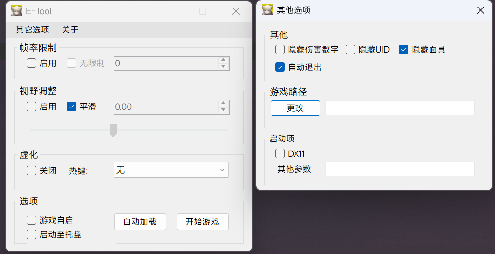
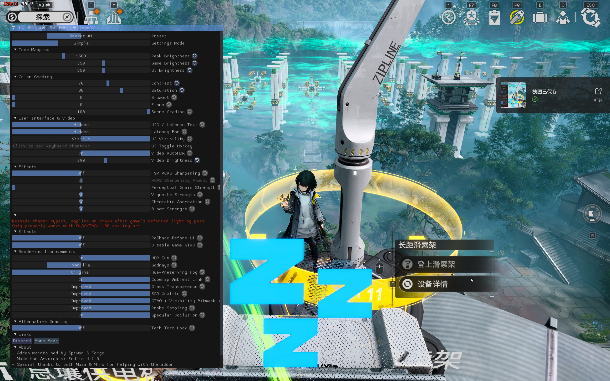

《明日方舟：终末地》原生不支持 HDR，因此需要通过插件注入的方式实现原生 HDR。这里采用 RenoDX 实现。

# 安装

> 非原作者，仅作分享

这里提供整合包下载，解压后放入游戏安装目录 `Hypergryph Launcher\games\Endfield Game` 即可。有能力的可以跟原作者教程。

- [整合包下载链接](https://r2.cialo.site/Endfield%20Game.zip)
- [插件下载 Nightly Build](https://github.com/clshortfuse/renodx/releases/download/snapshot/renodx-endfield.addon64)
- 原作者 Discord 频道邀请链接：[RenoDX](https://discord.gg/gF4GRJWZ2A)
- 指南原文（英语）：[Discord | "Arknights + AK Endfield" | RenoDX](https://discord.com/channels/1408098019194310818/1440801914165002322/1463311181899894784)
- 指南（GitHub 存档）：[Arknights : Endfield - HDR Mod (DX11 Only)](https://github.com/clshortfuse/renodx/discussions/490)

## 辅助插件

这边也推荐一下 [Ex_M](https://space.bilibili.com/44434084) 大佬写的插件，支持反虚化、解帧、隐藏面具/UID/伤害数字等功能。

- 下载链接：[Release_1.0.7z](https://r2.cialo.site/Release_1.0.7z)

# 启动游戏

:::important
启动游戏时记得勾选上启动器里面的 DX11 启动，否则会黑屏甚至崩溃！  
（或者使用 `-force-d3d11` 参数启动 `Endfield.exe` 绕过启动器）  
DX11 下帧生成不可用，可以用 NVIDIA App 的 Smooth Motion（现在显示为AI插帧）补帧作为替代，但是效果只能说一言难尽
:::

# 参数配置

> 按 Home 键呼出 ReShade 菜单，在顶部标签页找到 RenoDX 即可看到此界面。

---

## Tone Mapping (色调映射)

- **Tone Mapper (色调映射器)**  
   选择将 HDR pipeline 压缩进屏幕显示范围的算法。推荐保持 `RenoDRT`。`Vanilla` 是游戏默认的映射，用于将游戏原本的 HDR pipeline 映射为默认的 SDR，不推荐选择。
- **Peak Brightness (峰值亮度)**  
   告诉插件显示的目标峰值亮度 (nits)。
  > 设为显示器实际参数或偏低，设太高会导致太阳/灯光等高光细节丢失，变成一片死白。
- **Game Brightness (游戏亮度)**  
   决定了**普通场景**（非发光物体）看起来的基础亮度。
  > 按个人爱好调整，如果你觉得此时画面整体太昏暗就调高，觉得刺眼就调低。
- **UI Brightness (UI 界面亮度)**  
   建议设置得比 Game Brightness **稍低**。
- **Scene / UI Gamma (伽马校正)**  
   控制画面的亮度曲线。
- **Hue Shift (色相偏移模拟)**  
   光源或材质在不同亮度下，颜色的色相（Hue）会发生偏移，而不只是单纯变亮或变暗。这种现象源自人眼感知特性（Bezold–Brücke效应）以及物理光学规律。此项设置就是用算法模拟这种随亮度变化而产生色相漂移的自然效果，主要影响高光区域。  
   看个人喜好，不是技术参数，**没有标准答案**。  
   推荐设为 **0，关闭**。
- **Per Channel Blowout (逐通道过曝)**  
   在 HDR 高光过曝时，RGB 三个通道分别独立地被截断/溢出，而不是整体一起处理。用于模拟真实相机各通道单独过曝的效果，高光不是直接变白，而是有一个更自然的颜色过渡过程。
  - 关闭：三通道一起压，颜色整体变白
  - 开启：R通道先溢出变白，G/B还没到，结果高光边缘会出现色相偏移的过渡，更像真实相机/胶片的过曝表现

## Color Grading (调色)

调色参数，根据自己主观审美调整。

- **Exposure (曝光)**: 整体亮度调整
- **Highlights (高光)**: 亮部区域的亮度
- **Shadows (阴影)**: 暗部区域的亮度
- **Contrast (对比度)**: 亮暗之间的差异强度
- **Saturation (饱和度)**: 颜色鲜艳程度。终末地本身饱和度较低，可适当提高。
- **Highlight Saturation (高光饱和度)**: 单独控制亮部区域的饱和度。
- **Blowout (过曝去饱和)**: 控制因过曝导致的高光去饱和程度。即高光区域越亮，颜色会逐渐褪色趋向白色，模拟真实相机过曝时颜色"洗掉"的效果。
- **Flare (光晕补偿)**: 对镜头光晕/眩光进行补偿。现实中强光会在镜头内产生散射，这个参数用来模拟或抵消这种效果。
- **Scene Grading (场景调色)**: 由游戏本身应用的场景调色强度。即游戏内置 LUT 的应用强度，100为完全应用，0为关闭，调低了会发灰。**推荐设为100**。

## Effects (效果)

- **FSR RCAS Sharpening (FSR锐化)**: AMD 的锐化算法，开启后对画面进行锐化处理
- **RCAS Sharpening Amount (锐化强度)**: FSR RCAS Sharpening 的强度，仅在上方开启时生效
- **Perceptual Grain Strength (感知噪点强度)**: 模拟胶片颗粒感，增加画面质感
- **Vignette Strength (暗角强度)**: 画面四角变暗的程度，模拟镜头暗角效果 建议调为0
- **Bloom Strength (泛光强度)**: 发光物体向外扩散光晕的强度 建议保持默认50
- **ReShade Before UI (在 UI 之前渲染)**: 此选项试图将 ReShade 特效强行插队到 UI 绘制之前，避免滤镜影响 UI。但是如果你开启了 DLSS/FSR ，请务必**关闭 (Off)**，只有在你使用原生分辨率 (DLAA/Native) ，才建议**开启 (On)**。此外开关选项会导致深度通道反转，需要单独设置。

## Rendering Improvements (渲染改善)

- **HDR Sun (HDR 太阳)**: 重新调整太阳的渲染效果，使其更像 HDR 效果。**建议关闭**，因为此功能在1.1版本损坏。
- **Godrays (体积光)**: 光线穿透云层或障碍物产生的丁达尔光效果。
- **Improved Shadows (改善阴影)**: 改进物体和树叶阴影遮挡，**建议开启**。

# 游戏截图

> 注意流量消耗！  
> 使用支持 HDR 的环境观看以获得最佳效果

## 对比图

> 视频版本。无大会员的可看下方截图
>
> <iframe width="100%" height="468" src="//player.bilibili.com/player.html?bvid=BV1YoANz8E28&p=1&autoplay=0" scrolling="no" border="0" frameborder="no" framespacing="0" allowfullscreen="true" &autoplay=0> </iframe>

# 参阅

- [使用RenoDX实现《明日方舟：终末地》原生HDR支持](https://chaomeng.space/posts/2026-02-06/arknights-endfield-native-hdr)
- [Discord | "Arknights + AK Endfield" | RenoDX](https://discord.com/channels/1408098019194310818/1440801914165002322)
