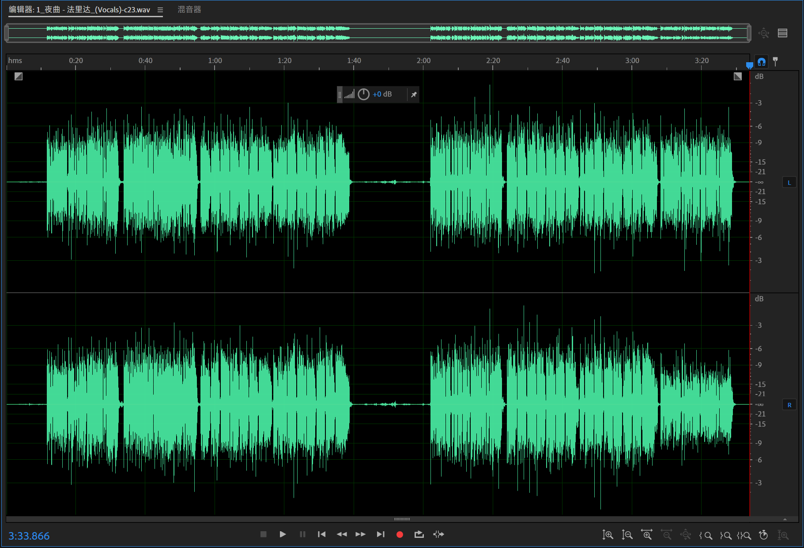
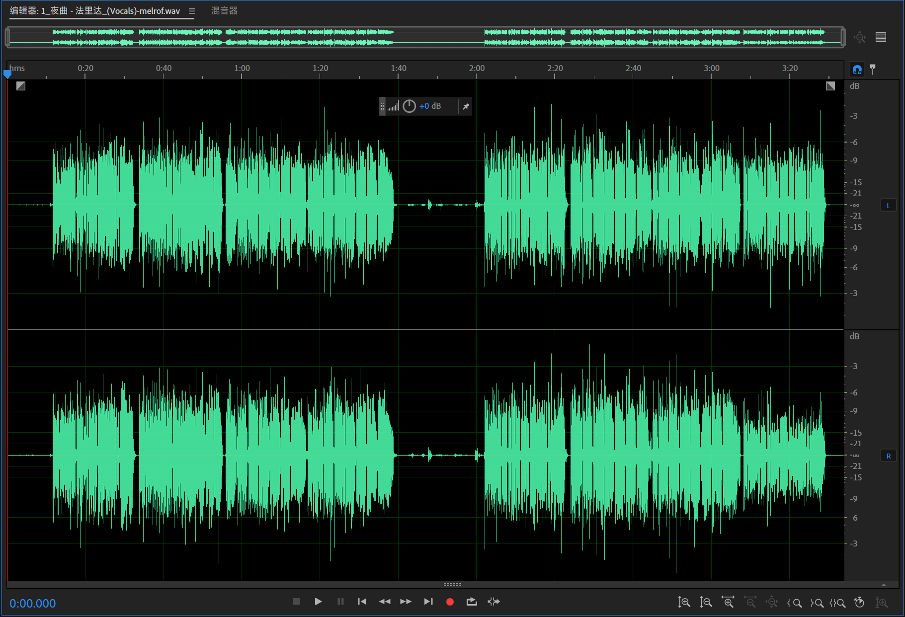
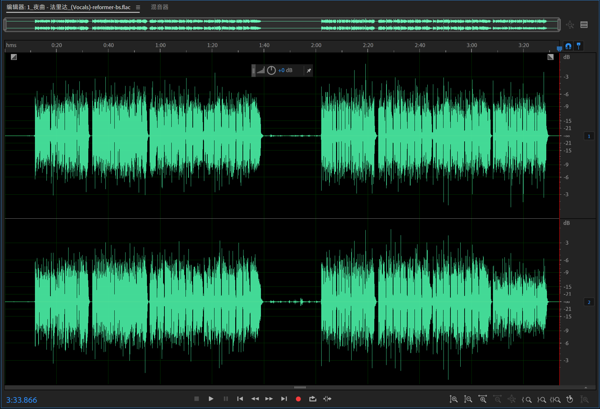
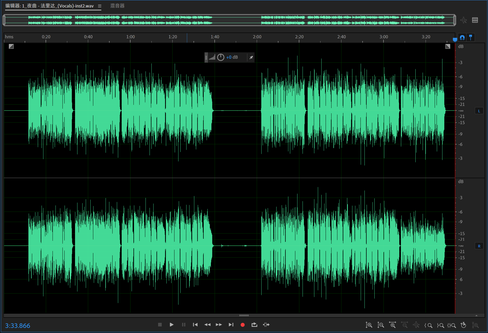
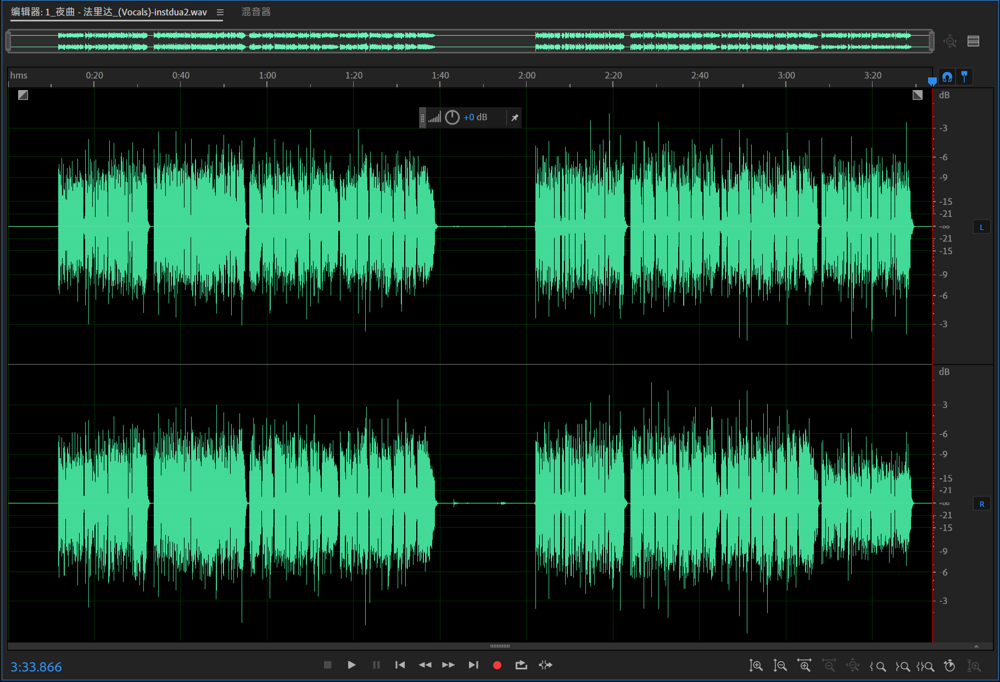

# ✅ 1. 「最高质量的人声伴奏分离（Vocal & Inst Separation）」

## Roformer Model: MelBand Roformer Kim | InstVoc Duality V2 by Unwa

- 权重文件：[melband_roformer_instvox_duality_v2.ckpt](https://huggingface.co/pcunwa/Mel-Band-Roformer-InstVoc-Duality/resolve/main/melband_roformer_instvox_duality_v2.ckpt)
- 配置文件：[config_melbandroformer_instvoc_duality.yaml](https://raw.githubusercontent.com/TRvlvr/application_data/main/mdx_model_data/mdx_c_configs/config_melbandroformer_instvoc_duality.yaml)

## Roformer Model: MelBand Roformer Kim | Inst V2 by Unwa

- 权重文件：[melband_roformer_inst_v2.ckpt](https://huggingface.co/pcunwa/Mel-Band-Roformer-Inst/resolve/main/melband_roformer_inst_v2.ckpt)
- 配置文件：[config_melbandroformer_inst_v2.yaml](https://raw.githubusercontent.com/TRvlvr/application_data/main/mdx_model_data/mdx_c_configs/config_melbandroformer_inst_v2.yaml)

# ✅ 2. 「主唱 vs 和声（Lead / Backing）」

## Roformer Model: Karaoke MelBand Roformer | (by aufr33 & viperx)

- 权重文件：[mel_band_roformer_karaoke_aufr33_viperx_sdr_10.1956.ckpt](https://github.com/TRvlvr/model_repo/releases/download/all_public_uvr_models/mel_band_roformer_karaoke_aufr33_viperx_sdr_10.1956.ckpt)
- 配置文件：[config_mel_band_roformer_karaoke.yaml](https://raw.githubusercontent.com/TRvlvr/application_data/main/mdx_model_data/mdx_c_configs/config_mel_band_roformer_karaoke.yaml)

# ✅ 3. 「去混响（De-Reverb）」

## Roformer Model: BS Roformer Dereverb | (anvuew edition)

- 权重文件：[deverb_bs_roformer_8_256dim_8depth.ckpt](https://huggingface.co/anvuew/deverb_bs_roformer/resolve/main/deverb_bs_roformer_8_256dim_8depth.ckpt)
- 配置文件：[deverb_bs_roformer_8_256dim_8depth.yaml](https://raw.githubusercontent.com/TRvlvr/application_data/main/mdx_model_data/mdx_c_configs/deverb_bs_roformer_8_256dim_8depth.yaml)

# 测试模型

- MDX23C-8KFFT-InstVoc_HQ.ckpt
- MelBandRoformer.ckpt
- model_bs_roformer_ep_317_sdr_12.9755.ckpt
- melband_roformer_inst_v2.ckpt
- model_mel_band_roformer_ep_3005_sdr_11.4360.ckpt
- melband_roformer_instvox_duality_v2.ckpt

# Vocal 波形

