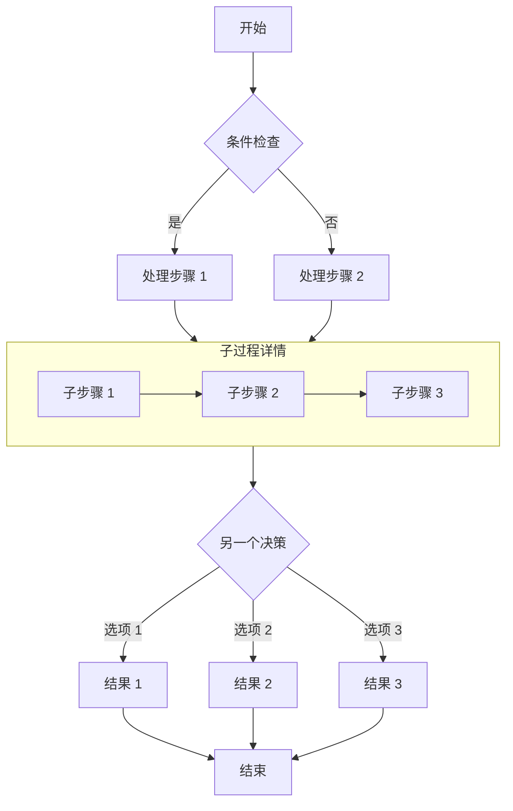
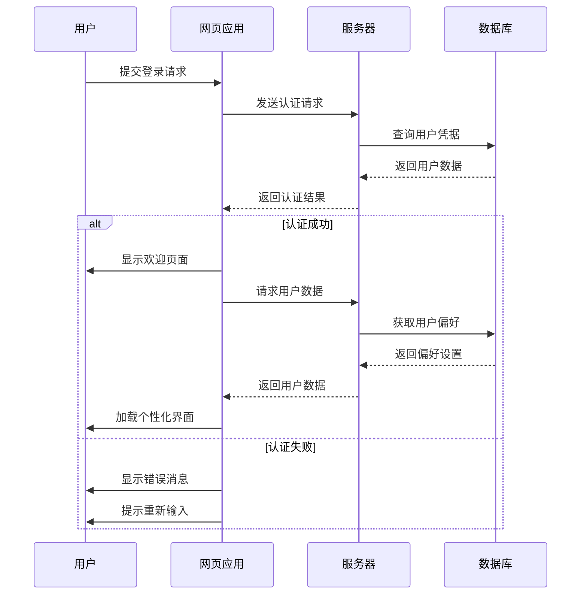
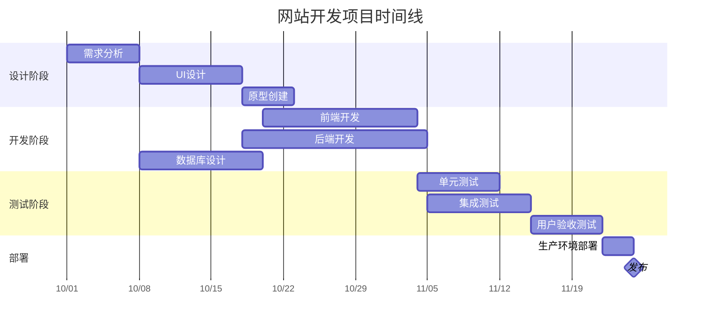
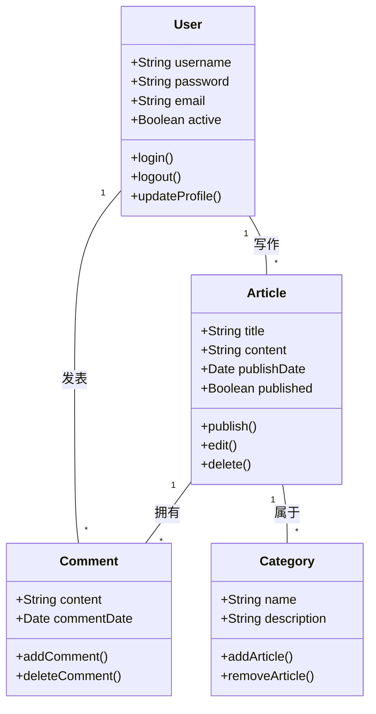
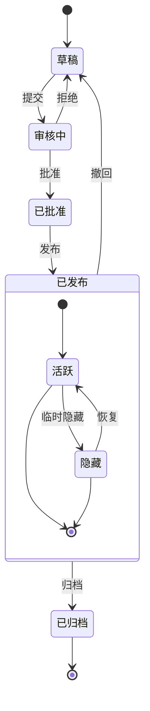
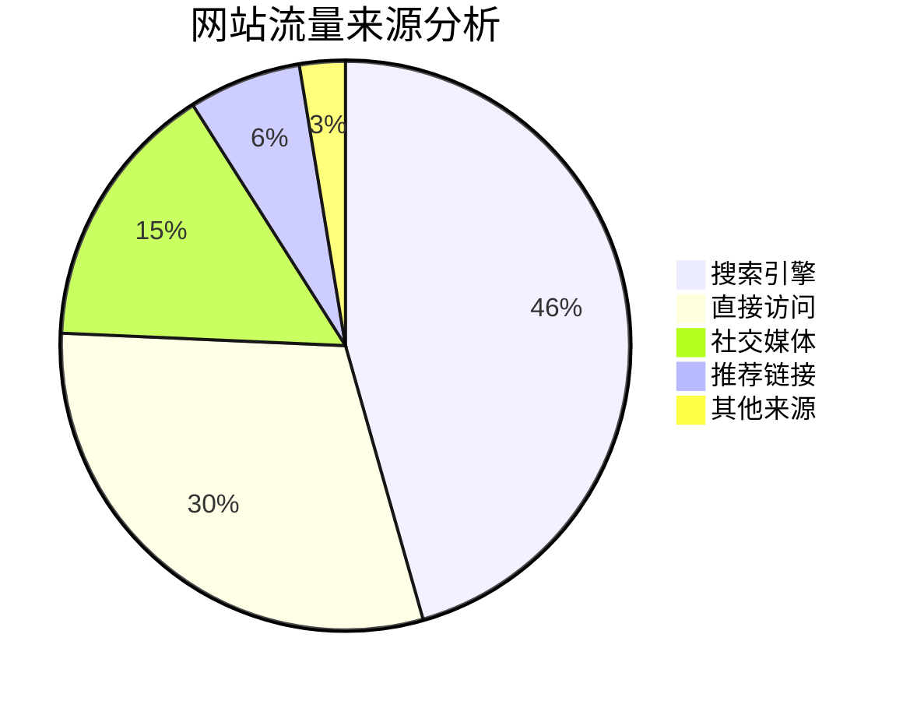

> 封面图片来源: [Source](<https://image.civitai.com/xG1nkqKTMzGDvpLrqFT7WA/208fc754-890d-4adb-9753-2c963332675d/width=2048/01651-1456859105-(colour_1.5),girl,_Blue,yellow,green,cyan,purple,red,pink,_best,8k,UHD,masterpiece,male%20focus,%201boy,gloves,%20ponytail,%20long%20hair,.jpeg>)

此博客模板基于 [Astro](https://astro.build/) 构建。若本指南未提及某些内容，你可在 [Astro Docs](https://docs.astro.build/) 中找到答案。

# 文章的 Front-matter

```yaml
---
title: 我的第一篇博客文章
published: 2023-09-09
description: 这是我新 Astro 博客的第一篇文章。
image: ./cover.jpg
tags: [前端, 开发]
category: 前端开发
draft: false
---
```

| 属性          | 描述                                                                                                                                                              |
| ------------- | ----------------------------------------------------------------------------------------------------------------------------------------------------------------- |
| `title`       | 文章标题。                                                                                                                                                        |
| `published`   | 文章发布日期。                                                                                                                                                    |
| `pinned`      | 是否将此文章置顶在文章列表顶部。                                                                                                                                  |
| `description` | 文章的简短描述。显示在首页上。                                                                                                                                    |
| `image`       | 文章封面图片路径。<br/>1. 以 `http://` 或 `https://` 开头：使用网络图片<br/>2. 以 `/` 开头：`public` 目录中的图片<br/>3. 不带任何前缀：相对于 markdown 文件的路径 |
| `tags`        | 文章标签。                                                                                                                                                        |
| `category`    | 文章分类。                                                                                                                                                        |
| `licenseName` | 文章内容的许可证名称。                                                                                                                                            |
| `author`      | 文章作者。                                                                                                                                                        |
| `sourceLink`  | 文章内容的来源链接或参考。                                                                                                                                        |
| `draft`       | 如果这篇文章仍是草稿，则不会显示。                                                                                                                                |
| `slug`        | 自定义文章 URL 路径。如果不设置，将使用文件名作为 URL。                                                                                                           |

## 自定义文章 URL (Slug)

Slug 是文章 URL 路径的自定义部分。如果不设置 slug，系统将使用文件名作为 URL。

### Slug 使用示例

```yaml
---
title: 我的第一篇博客文章
published: 2023-09-09
slug: hello-world
---
```

文件：`src/content/posts/my-first-blog-post.md`
URL：`/posts/hello-world`

### Slug 使用建议

1. **使用英文和连字符**：`my-awesome-post` 而不是 `my awesome post`
2. **保持简洁**：避免过长的 slug
3. **具有描述性**：让 URL 能够反映文章内容
4. **避免特殊字符**：只使用字母、数字和连字符
5. **保持一致性**：在整个博客中使用相似的命名模式

### 注意事项

- Slug 一旦设置并发布，建议不要随意更改，以免影响 SEO 和已存在的链接
- 如果多个文章使用相同的 slug，后面的文章会覆盖前面的
- Slug 会自动转换为小写

# GitHub 仓库卡片

您可以添加链接到 GitHub 仓库的动态卡片，在页面加载时，仓库信息会从 GitHub API 获取。

::github{repo="CuteLeaf/Firefly"}

使用代码 `::github{repo="CuteLeaf/Firefly"}` 创建 GitHub 仓库卡片。

```markdown
::github{repo="CuteLeaf/Firefly"}
```

# 提醒框

支持以下类型的提示框：`note` `tip` `important` `warning` `caution`

:::note
突出显示用户应该考虑的信息，即使在快速浏览时也是如此。
:::

:::tip
可选信息，帮助用户更成功。
:::

:::important
用户成功所必需的关键信息。
:::

:::warning
由于潜在风险需要用户立即注意的关键内容。
:::

:::caution
行动的负面潜在后果。
:::

## 基本语法

```markdown
:::note
强调用户即使在快速浏览时也应该注意的信息。
:::

:::tip
可选信息，用于帮助用户更好地完成操作。
:::
```

## 自定义标题

提示框的标题可以自定义。

:::note[我的自定义标题]
这是一个带有自定义标题的 note。
:::

```markdown
:::note[我的自定义标题]
这是一个带有自定义标题的 note。
:::
```

## GitHub Syntax

> [!TIP]
> 也支持 [GitHub 语法](https://github.com/orgs/community/discussions/16925)。

```
> [!NOTE]
> 也支持 GitHub 语法。

> [!TIP]
> 也支持 GitHub 语法。
```

## 剧透 Spoiler

你可以在文字中添加剧透隐藏区块。内容也支持 **Markdown** 语法。

The content :spoiler[is hidden **哈哈**]!

```markdown
The content :spoiler[is hidden **哈哈**]!
```

---

# 代码块示例

这里展示使用 [Expressive Code](https://expressive-code.com/) 时代码块的外观。以下示例基于官方文档，你可以参考文档获取更多信息。

## 表达性代码

### 语法高亮

[语法高亮](https://expressive-code.com/key-features/syntax-highlighting/)

#### 常规语法高亮

```js
console.log("此代码有语法高亮!");
```

#### 渲染 ANSI 转义序列

```ansi
ANSI 颜色:
- 普通: 红 绿 黄 蓝 品红 青
- 加粗: 红 绿 黄 蓝 品红 青
- 暗淡: 红 绿 黄 蓝 品红 青

256 色（示例颜色 160–177）:
160 161 162 163 164 165
166 167 168 169 170 171
172 173 174 175 176 177

完整 RGB 色:
森林绿 - RGB(34, 139, 34)

文本格式: 加粗 暗淡 斜体 下划线
```

### 编辑器和终端框架

[编辑器和终端框架](https://expressive-code.com/key-features/frames/)

#### 代码编辑器框架

```js title="my-test-file.js"
console.log("标题属性示例");
```

---

```html
<!-- src/content/index.html -->
<div>文件名注释示例</div>
```

#### 终端框架

```bash
echo "这个终端窗口没有标题"
```

---

```powershell title="PowerShell 终端示例"
Write-Output "这个终端窗口有标题！"
```

#### 覆盖框架类型

```sh frame="none"
echo "看，我没有外框！"
```

---

```ps frame="code" title="PowerShell Profile.ps1"
# 如果不覆盖，这段会显示为终端框架
function Watch-Tail { Get-Content -Tail 20 -Wait $args }
New-Alias tail Watch-Tail
```

### 文本和行标记

[文本和行标记](https://expressive-code.com/key-features/text-markers/)

#### 标记整行和行范围

```js {1, 4, 7-8}
// 行 1 - 由行号标记
// 行 2
// 行 3
// 行 4 - 由行号标记
// 行 5
// 行 6
// 行 7 - 由范围 "7-8" 标记
// 行 8 - 由范围 "7-8" 标记
```

#### 选择行标记类型 (mark, ins, del)

```js title="line-markers.js" del={2} ins={3-4} {6}
function demo() {
  console.log("此行被标记为删除");
  // 这行和下一行被标记为插入
  console.log("这是第二行插入内容");

  return "此行使用默认标记类型";
}
```

#### 为行标记添加标签

```jsx {"1":5} del={"2":7-8} ins={"3":10-12}
// labeled-line-markers.jsx
<button
  role="button"
  {...props}
  value={value}
  className={buttonClassName}
  disabled={disabled}
  active={active}
>
  {children &&
    !active &&
    (typeof children === "string" ? <span>{children}</span> : children)}
</button>
```

#### 在单独行上添加长标签

```jsx {"1. 在这里提供 value 属性:":5-6} del={"2. 移除 disabled 和 active 状态:":8-10} ins={"3. 添加此内容以在按钮中渲染 children:":12-15}
// labeled-line-markers.jsx
<button
  role="button"
  {...props}
  value={value}
  className={buttonClassName}
  disabled={disabled}
  active={active}
>
  {children &&
    !active &&
    (typeof children === "string" ? <span>{children}</span> : children)}
</button>
```

#### 使用类似 diff 的语法

```diff
+这行将被标记为插入
-这行将被标记为删除
这是一行普通文本
```

---

```diff
--- a/README.md
+++ b/README.md
@@ -1,3 +1,4 @@
+这是一份真实的 diff 文件
-所有内容将保持不变
 不会移除任何空白字符
```

#### 结合语法高亮和类似 diff 的语法

```diff lang="js"
  function thisIsJavaScript() {
    // 这一整个代码块仍会按 JavaScript 高亮，
    // 同时仍可应用 diff 标记！
-   console.log('旧代码，将被移除')
+   console.log('新的、更好的代码！')
  }
```

#### 标记行内的单独文本

```js "given text"
function demo() {
  // 可标记行内任意指定文本
  return "支持标记指定文本的多个匹配项";
}
```

#### 正则表达式

```ts /ye[sp]/
console.log("单词 yes 和 yep 会被标记。");
```

#### 转义正斜杠

```sh //ho.*//
echo "Test" > /home/test.txt
```

#### 选择内联标记类型 (mark, ins, del)

```js "return true;" ins="inserted" del="deleted"
function demo() {
  console.log("这些是插入与删除标记类型");
  // return 语句使用默认标记类型
  return true;
}
```

### 自动换行

[自动换行](https://expressive-code.com/key-features/word-wrap/)

#### 为每个块配置自动换行

```js wrap
// wrap 示例
function getLongString() {
  return "这是一段非常长的字符串，如果容器不够宽，几乎不可能完全显示";
}
```

---

```js wrap=false
// wrap=false 示例
function getLongString() {
  return "这是一段非常长的字符串，如果容器不够宽，几乎不可能完全显示";
}
```

#### 配置换行的缩进

```js wrap preserveIndent
// preserveIndent 示例（默认启用）
function getLongString() {
  return "这是一段非常长的字符串，如果容器不够宽，几乎不可能完全显示";
}
```

---

```js wrap preserveIndent=false
// preserveIndent=false 示例
function getLongString() {
  return "这是一段非常长的字符串，如果容器不够宽，几乎不可能完全显示";
}
```

## 可折叠部分

[可折叠部分](https://expressive-code.com/plugins/collapsible-sections/)

```js collapse={1-5, 12-14, 21-24}
// 下方这些样板设置代码将被折叠
import { someBoilerplateEngine } from "@example/some-boilerplate";
import { evenMoreBoilerplate } from "@example/even-more-boilerplate";

const engine = someBoilerplateEngine(evenMoreBoilerplate());

// 这一部分将默认显示
engine.doSomething(1, 2, 3, calcFn);

function calcFn() {
  // 你可以拥有多个折叠区块
  const a = 1;
  const b = 2;
  const c = a + b;

  // 这一部分保持可见
  console.log(`计算结果: ${a} + ${b} = ${c}`);
  return c;
}

// 直到块末尾的所有代码将再次被折叠
engine.closeConnection();
engine.freeMemory();
engine.shutdown({ reason: "样板代码示例结束" });
```

## 行号

[行号](https://expressive-code.com/plugins/line-numbers/)

### 为每个块显示行号

```js showLineNumbers
// 此代码块将显示行号
console.log("来自第 2 行的问候！");
console.log("我在第 3 行");
```

```js showLineNumbers=false
// 此代码块禁用行号
console.log("有人吗？");
console.log("呃，我在第几行？");
```

### 更改起始行号

```js showLineNumbers startLineNumber=5
console.log("来自第 5 行的问候！");
console.log("我在第 6 行");
```

# KaTeX 数学公式示例

## 行内公式 (Inline)

行内公式使用单个 `$` 符号包裹。

例如：欧拉公式 $e^{i\pi} + 1 = 0$ 是数学中最优美的公式之一。

质能方程 $E = mc^2$ 也是家喻户晓。

## 块级公式 (Block)

块级公式使用两个 `$$` 符号包裹，会居中显示。

$$
\int_{-\infty}^{\infty} e^{-x^2} dx = \sqrt{\pi}
$$

$$
x = \frac{-b \pm \sqrt{b^2 - 4ac}}{2a}
$$

## 复杂示例

### 矩阵 (Matrices)

$$
\begin{pmatrix}
a & b \\
c & d
\end{pmatrix}
\begin{pmatrix}
\alpha & \beta \\
\gamma & \delta
\end{pmatrix} =
\begin{pmatrix}
a\alpha + b\gamma & a\beta + b\delta \\
c\alpha + d\gamma & c\beta + d\delta
\end{pmatrix}
$$

### 极限与求和 (Limits and Sums)

$$
\sum_{n=1}^{\infty} \frac{1}{n^2} = \frac{\pi^2}{6}
$$

$$
\lim_{x \to 0} \frac{\sin x}{x} = 1
$$

### 麦克斯韦方程组 (Maxwell's Equations)

$$
\begin{aligned}
\nabla \cdot \mathbf{E} &= \frac{\rho}{\varepsilon_0} \\
\nabla \cdot \mathbf{B} &= 0 \\
\nabla \times \mathbf{E} &= -\frac{\partial \mathbf{B}}{\partial t} \\
\nabla \times \mathbf{B} &= \mu_0\mathbf{J} + \mu_0\varepsilon_0\frac{\partial \mathbf{E}}{\partial t}
\end{aligned}
$$

### 化学方程式 (Chemical Equations)

$$
\ce{CH4 + 2O2 -> CO2 + 2H2O}
$$

## 更多符号

| 符号        | 代码          | 渲染结果      |
| :---------- | :------------ | :------------ |
| Alpha       | `\alpha`      | $\alpha$      |
| Beta        | `\beta`       | $\beta$       |
| Gamma       | `\Gamma`      | $\Gamma$      |
| Pi          | `\pi`         | $\pi$         |
| Infinity    | `\infty`      | $\infty$      |
| Right Arrow | `\rightarrow` | $\rightarrow$ |
| Partial     | `\partial`    | $\partial$    |

更多 KaTeX 语法请参考 [KaTeX Supported Functions](https://katex.org/docs/supported.html)。

# Markdown 中 Mermaid 图表完整指南

## 流程图示例

流程图非常适合表示流程或算法步骤。



## 时序图示例

时序图显示对象之间随时间的交互。



## 甘特图示例

甘特图非常适合显示项目进度和时间线。



## 类图示例

类图显示系统的静态结构，包括类、属性、方法及其关系。



## 状态图示例

状态图显示对象在其生命周期中经历的状态序列。



## 饼图示例

饼图非常适合显示比例和百分比数据。


